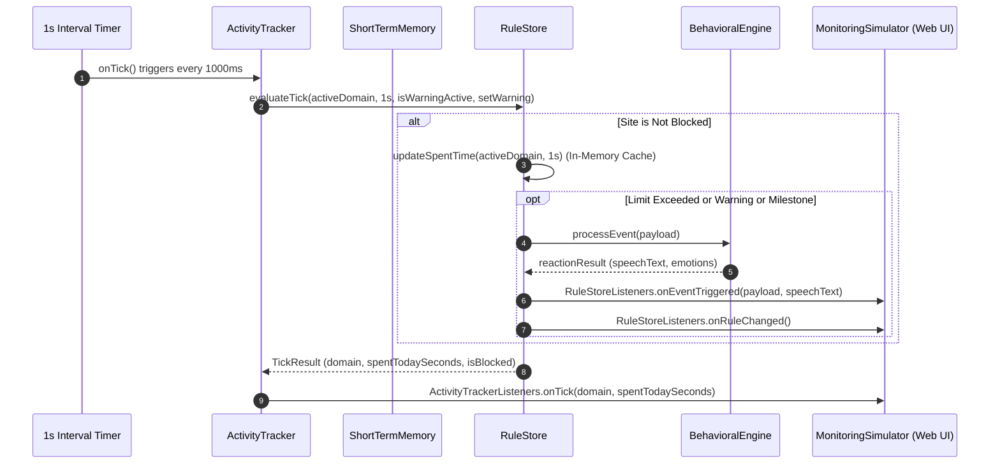

# Monitoring Subsystem Listeners & `onTick` Architecture

This document provides a detailed breakdown of the listener mechanisms in [`src/monitoring/activity-tracker.ts`](file:///c:/Users/ron/ReactProjects/Cleo/src/monitoring/activity-tracker.ts) and [`src/monitoring/rule-store.ts`](file:///c:/Users/ron/ReactProjects/Cleo/src/monitoring/rule-store.ts), focusing on the 1-second `onTick` lifecycle and how [`web/components/MonitoringSimulator.tsx`](file:///c:/Users/ron/ReactProjects/Cleo/web/components/MonitoringSimulator.tsx) consumes them.

---

## 1. High-Level Architecture Overview

The monitoring subsystem separates **time tracking** (`ActivityTracker`) from **rule evaluation** (`RuleStore`), which in turn delegates to the **behavioral & emotion engine** (`BehavioralEngine`).



---

## 2. The Listener Interfaces

### A. `ActivityTrackerListeners`
Located in [`src/monitoring/activity-tracker.ts`](file:///c:/Users/ron/ReactProjects/Cleo/src/monitoring/activity-tracker.ts):

```typescript
export interface ActivityTrackerListeners {
  /**
   * Fires every 1 second after a tick has been processed by RuleStore.
   * @param activeDomain The currently active domain (e.g., "youtube.com")
   * @param spentTodaySeconds The total cumulative seconds spent today on this domain
   */
  onTick?: (activeDomain: string, spentTodaySeconds: number) => void;
}
```

#### Purpose:
- **UI Progress & Ticker Updates**: Informs subscribers every 1 second of the active domain and updated usage time.
- **Purely Observational**: It does not evaluate rules; it reports the outcome of the tick after `RuleStore.evaluateTick` completes.

---

### B. `RuleStoreListeners`
Located in [`src/monitoring/rule-store.ts`](file:///c:/Users/ron/ReactProjects/Cleo/src/monitoring/rule-store.ts):

```typescript
export interface RuleStoreListeners {
  /**
   * Fires when an activity triggers a behavioral reaction with dialogue/speech.
   * (e.g. limit warnings, limit exceeded/block, productive rewards, puzzle unblock)
   */
  onEventTriggered?: (payload: MonitoringEventPayload, speechText: string) => void;

  /**
   * Fires whenever a site rule is added, removed, blocked, unblocked,
   * or when its limit/type changes.
   */
  onRuleChanged?: () => void;
}
```

#### Purpose:
1. **`onEventTriggered`**: Connects business rules to avatar presentation (audio speech, speech bubble text, emotion state changes, and short-term memory event streams).
2. **`onRuleChanged`**: Notifies subscribers that the rules configuration (e.g., limits, blocked status, productive flags) has structurally changed and requires a UI table refresh.

---

## 3. Detailed Step-by-Step `onTick` Execution Flow

Here is what happens during a single 1-second interval:

```
[Interval Timer (1000ms)]
          │
          ▼
1. ActivityTracker.onTick()
          │
          ├──> 1.1 Checks if day rolled over:
          │        If currentDate !== lastCheckedDate:
          │        Calls shortTermMemory.consolidateToLongTermMemory('day_change')
          │
          └──> 1.2 Calls RuleStore.evaluateTick(activeDomain, deltaSeconds = 1, ...):
                   │
                   ├── Case A: Domain is BLOCKED
                   │   └── Returns immediately: { isBlocked: true, ruleChanged: false }
                   │
                   ├── Case B: Domain is ACTIVE (Not Blocked)
                   │   ├── Increments spentTodaySeconds in memory cache
                   │   │
                   │   ├── Check 1: 'avoid' domain exceeded daily limit:
                   │   │   ├── Changes rule.type = 'blocked'
                   │   │   ├── Emits 'LIMIT_EXCEEDED' event to BehavioralEngine
                   │   │   ├── Fires RuleStoreListeners.onEventTriggered(payload, speechText)
                   │   │   └── Fires RuleStoreListeners.onRuleChanged()
                   │   │
                   │   ├── Check 2: 'avoid' domain reached warning threshold (e.g. 75%):
                   │   │   ├── Emits 'LIMIT_WARNING' event to BehavioralEngine
                   │   │   └── Fires RuleStoreListeners.onEventTriggered(payload, speechText)
                   │   │
                   │   └── Check 3: 'productive' domain reached milestone interval (e.g. every 60s):
                   │       ├── Emits 'PRODUCTIVE_MILESTONE' event to BehavioralEngine
                   │       └── Fires RuleStoreListeners.onEventTriggered(payload, speechText)
                   │
                   ▼
2. ActivityTracker receives TickResult
          │
          ▼
3. ActivityTracker fires ActivityTrackerListeners.onTick(domain, spentTodaySeconds)
          │
          ▼
4. MonitoringSimulator (Web UI) updates React state:
   - setSiteRules([...rs.getSiteRules()])
   - setTickCounter(prev => prev + 1)
```

---

## 4. How `MonitoringSimulator.tsx` Uses These Listeners

In the Web Playground ([`web/components/MonitoringSimulator.tsx`](file:///c:/Users/ron/ReactProjects/Cleo/web/components/MonitoringSimulator.tsx)), all components run in the browser's single JavaScript thread. The component wires the listeners during `useEffect`:

```typescript
// web/components/MonitoringSimulator.tsx (Lines 53-90)

useEffect(() => {
  const ltm = new LongTermMemory();
  const stm = new ShortTermMemory(ltm);
  const llm = new LLMService();
  const rg = new ResponseGenerator(stm, llm);
  const be = new BehavioralEngine(emotionEngine, rg, stm);

  // 1. Initialize RuleStore with RuleStoreListeners
  const rs = new RuleStore(be, {
    onEventTriggered: (payload, speechText) => {
      // Updates Cleo's emotion wheel & facial expression
      onRefreshEmotionState();
      
      // Makes Cleo speak dialogue through the speech bubble & TTS
      onSpeakText(speechText);
      
      // Adds the new event to the short-term memory stream in the UI
      setMemoryEvents([...stm.getRecentEvents(10)]);
    },
    onRuleChanged: () => {
      // Refreshes the site rules table when a rule is modified/blocked/unblocked
      setSiteRules([...rs.getSiteRules()]);
      setTickCounter((prev) => prev + 1);
    },
  });

  // 2. Initialize ActivityTracker with ActivityTrackerListeners
  const instance = new ActivityTracker(rs, stm, {
    onTick: () => {
      // Re-renders the rules table & progress bar every second with updated spent seconds
      setSiteRules([...rs.getSiteRules()]);
      setTickCounter((prev) => prev + 1);
    },
  });

  // 3. Store references in component state
  setTracker(instance);
  setRuleStore(rs);
  setBehavioralEngine(be);
  setShortTermMemory(stm);
  setSiteRules(rs.getSiteRules());
  setMemoryEvents([...stm.getRecentEvents(10)]);

  return () => {
    // Clean up timer when simulator unmounts
    instance.stopTicker();
  };
}, [emotionEngine]);
```

---

## 5. Summary of Differences: Web Simulator vs. Electron Desktop

| Feature | Web Simulator (`MonitoringSimulator.tsx`) | Electron Desktop App (`src/main.ts`) |
| :--- | :--- | :--- |
| **Execution Context** | Single renderer thread in browser | Main Process (Node.js) & Renderer (React UI) |
| **Listener Connection** | Direct in-memory callback functions passed to constructors | Main process runs `ActivityTracker`, communicates to UI via IPC (`electronAPI`) |
| **UI Updates** | Triggered directly via `onTick` and `onRuleChanged` callbacks | Renderer queries `getSiteRules()` or receives IPC push messages |
| **Storage / Persistence** | In-memory cache + `localStorage` fallback on exit | In-memory cache + root [`user-data/`](file:///c:/Users/ron/ReactProjects/Cleo/user-data) JSON files on exit |
